= IoT Summit Lab 2016 - Building a VM

:Author:    Patrick Steiner
:Email:     psteiner@redhat.com
:Date:      17.05.2016

:toc: macro

toc::[]

== Scope
This document is intended for those people who would like to perform the
IoT-Lab, as described in this repository.

The instructions are based on Red Hat Enterprise Linux V7.2 (RHEL) but can easily be
re-done on other Operatingsystems, if you have the basic skills to install
software, etc.

In the course of this document, we will assume that you will run RHEL in a VM, but
bare metal deployments will work as well.

== Pre-Requisite
You will need to install a RHEL V7.2 with

 * 2 CPUs
 * 4 GB RAM ( more is always good )
 * 20GB Storage with

During the installation please select to install the server with GUI.

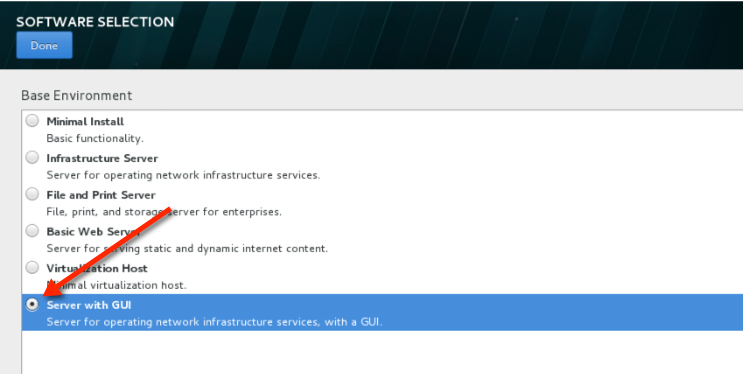

For simplicity we will use the default setting for the disk partitions.

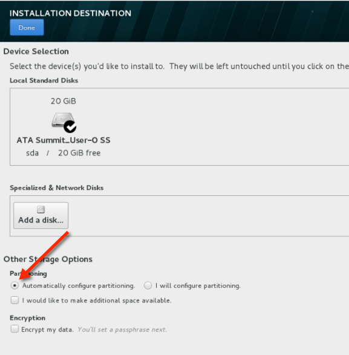

Also make sure that your network is activated.

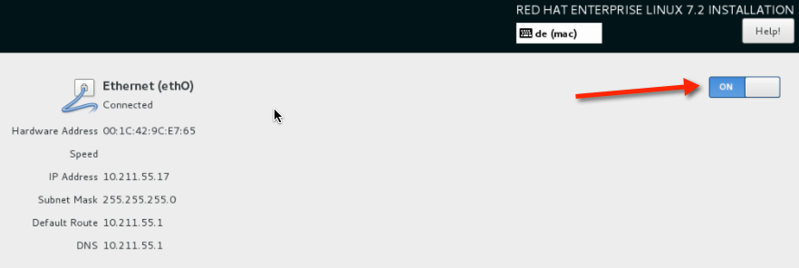

I usually create a user called "demo-user" with admin rights, but you can call
your user whatever you want.

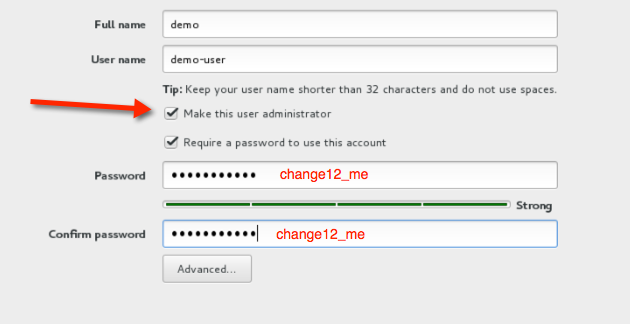

After completing the install precedure, please make sure to register your RHEL
installation and bring it to the most current level via

 yum upgrade

== Additional Installations
To be able to run the demo-labs, you will need the following products/packages
installed:

=== Additional RHEL packages
To install additional RHEL packages, please perform the following steps

 [demo-user@iotlab Desktop]$ sudo subscription-manager repos --enable="rhel-7-server-rpms"  --enable="rhel-7-server-extras-rpms"  --enable="rhel-7-server-ose-3.0-rpms"
 [demo-user@iotlab Desktop]$ sudo yum -y install java-1.7.0-openjdk-devel wget git unzip
 [sudo] password for demo-user:

 === Installing Maven
 For the builds to work automatically, we need to install Apache Maven. Please do
 so by performing the following steps

  [demo-user@iotlab Desktop]$ cd
  [demo-user@iotlab ~]$ wget http://mirror.softaculous.com/apache/maven/maven-3/3.3.9/binaries/apache-maven-3.3.9-bin.zip
--2016-05-17 17:17:03--  http://mirror.softaculous.com/apache/maven/maven-3/3.3.9/binaries/apache-maven-3.3.9-bin.zip
  [demo-user@iotlab ~]$ unzip apache-maven-3.3.9-bin.zip
  [demo-user@iotlab ~]$ sudo ln -s /opt/maven/bin/mvn /usr/bin/mvn

Now please create a file called '/etc/profile.d/maven.sh' with the following content

 #!/bin/bash
 MAVEN_HOME=/opt/maven
 PATH=$MAVEN_HOME/bin:$PATH
 export PATH MAVEN_HOME
 export CLASSPATH=.

And again, run the following commands

 [demo-user@iotlab ~]$ sudo chmod +x /etc/profile.d/maven.sh
 [demo-user@iotlab ~]$ source /etc/profile.d/maven.sh

== Getting the Red Hat Products

=== Red Hat JBoss Fuse
As for the writing of these instructions, Red Hat JBoss Fuse has been released
in Version 6.2.1

Please download this version from the https://access.redhat.com/jbossnetwork/restricted/listSoftware.html?product=jboss.fuse&downloadType=distributions[Red Hat Customer Portal]

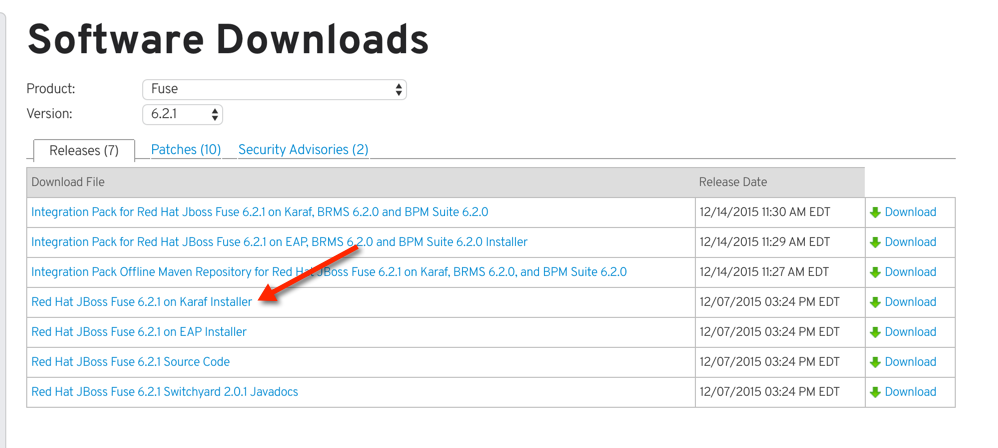

After downloading it, please place the file 'jboss-fuse-full-6.2.1.redhat-084.zip'
into the home-directory of your user. In my case the command required is

 [demo-user@iotlab ~]$ mv Downloads/jboss-fuse-full-6.2.1.redhat-084.zip /home/demo-user

=== Red Hat JBoss Developer Studio
Red Hat JBoss Developer Studio ( JBDS ) in the Eclipse based tooling
for all JBoss products. It's capabilities can be installed onto an
existing Eclipse or already bundled.

For this setup, we will download JBDS from the https://access.redhat.com/jbossnetwork/restricted/listSoftware.html?downloadType=distributions&product=jbossdeveloperstudio&version=8.1.0[Red Hat Customer Portal],
but please make sure to download the V8.1

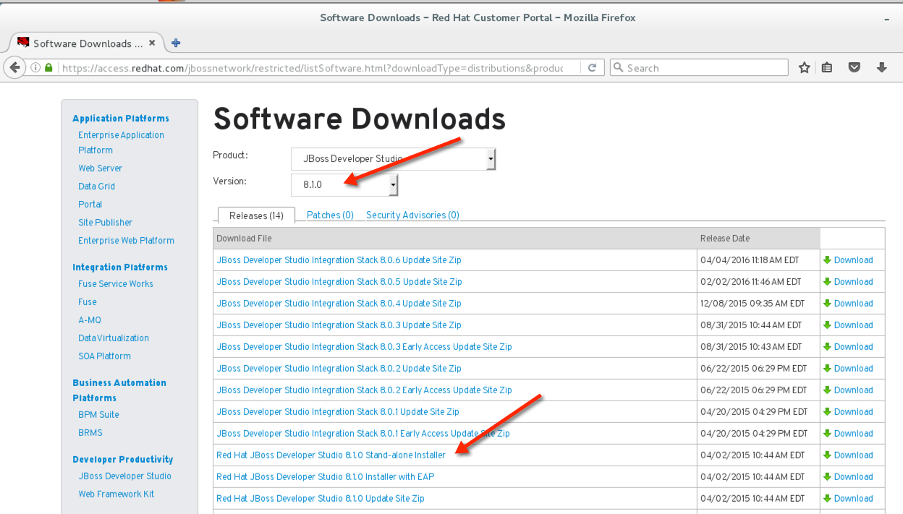

Once the download completed, you can run the installer via

 [demo-user@iotlab ~]$ java -jar Downloads/jboss-devstudio-8.1.0.GA-installer-standalone.jar

For simplicity, accept all defaults and let the installer add an icon onto the desktop

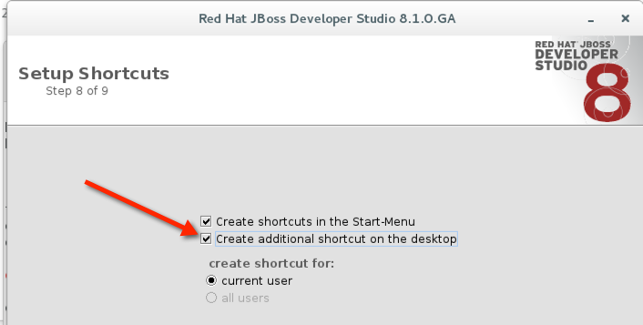

Run JBDS after the installation completed

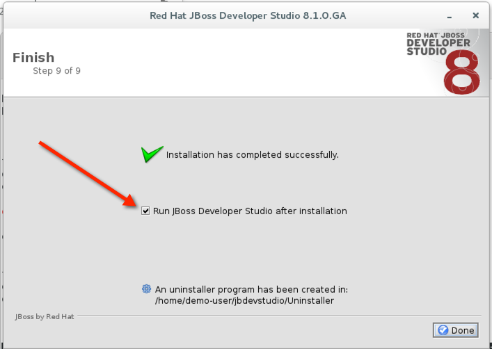

You can, again, accept the defaults for the proposed Eclipse 'workspace'.

It is up to you, if you want to let Red Hat receive usage statistics or not.

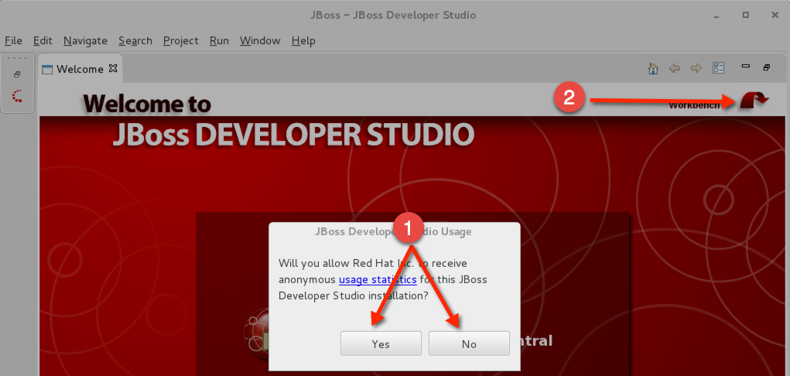

Once JBDS has fully started and the 'workspace' is shown, you will have to
switch to the panel to install additional software into JBDS

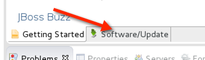

Select *JBoss Fuse Development* for installation.

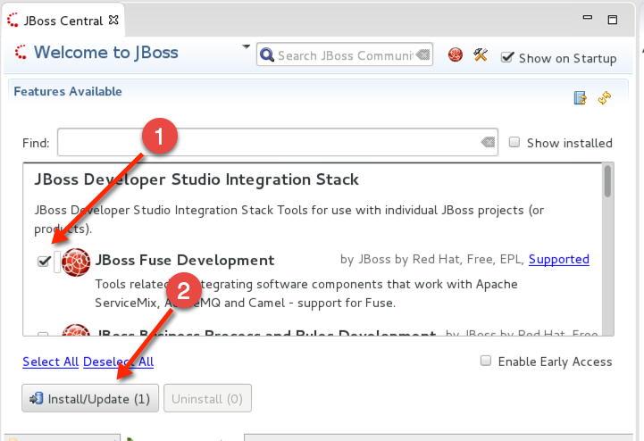

After installing the Tooling and restarting JBDS, you can import the source
projects for the labs, to do so, perform the following steps

 * Open the 'Import' wizard of JBDS

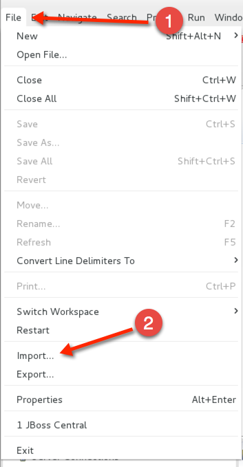

 * Select 'Existing Maven Project' as import source

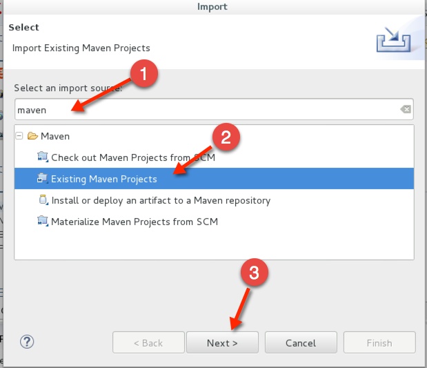

 * Select the '/home/demo-user/IoT_Summit_Lab/RoutingService' directory

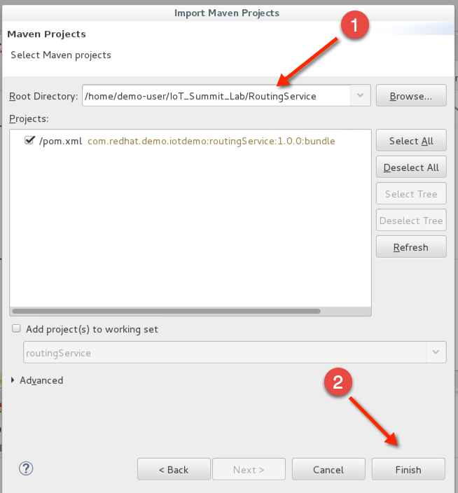

 * Have patience or a cup of coffee, as JBDS downloads a lot of Maven dependencies for you.

 * Re-Do the same steps for the project in '/home/demo-user/IoT_Summit_Lab/BusinessRulesService'

== Installing LibreOffice
For the MS Excel based decision table, we need some kind of spreadsheet
application. We have chosen to go for *LibreOffice* but any other application
capable of reading and writing MS Excel is OK.

To install *LibreOffice* please perform the following commands

 [demo-user@iotlab IoT_Summit_Lab]$ cd
 [demo-user@iotlab ~]$ wget http://download.documentfoundation.org/libreoffice/stable/5.1.3/rpm/x86_64/LibreOffice_5.1.3_Linux_x86-64_rpm.tar.gz
 [demo-user@iotlab ~]$ tar -xvf LibreOffice_5.1.3_Linux_x86-64_rpm.tar.gz
 [demo-user@iotlab ~]$ cd LibreOffice_5.1.3.2_Linux_x86-64_rpm/RPMS/
 [demo-user@iotlab RPMS]$ sudo yum localinstall *.rpm

== Getting the Lab-Code and instructions
To clone the IoT-Lab exercises into your system, please perform the following
steps

 [demo-user@iotlab ~]$ cd
 [demo-user@iotlab ~]$ git clone https://github.com/PatrickSteiner/IoT_Summit_Lab
 Cloning into 'IoT_Summit_Lab'...
 remote: Counting objects: 320, done.
 remote: Compressing objects: 100% (76/76), done.
 remote: Total 320 (delta 25), reused 0 (delta 0), pack-reused 218
 Receiving objects: 100% (320/320), 2.93 MiB | 647.00 KiB/s, done.
 Resolving deltas: 100% (81/81), done.

 Now you are ready to proceed with the Labs! Have fun!
