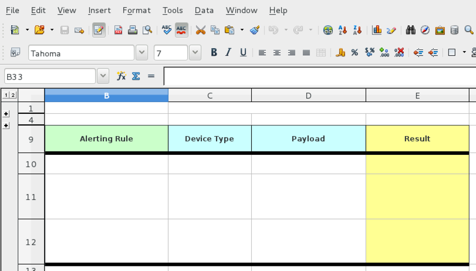
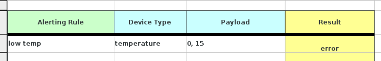
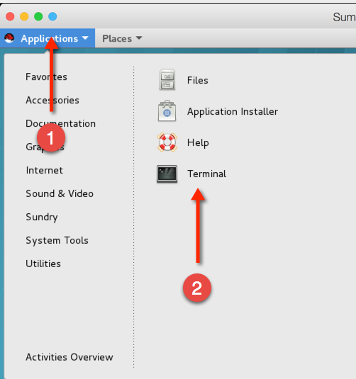
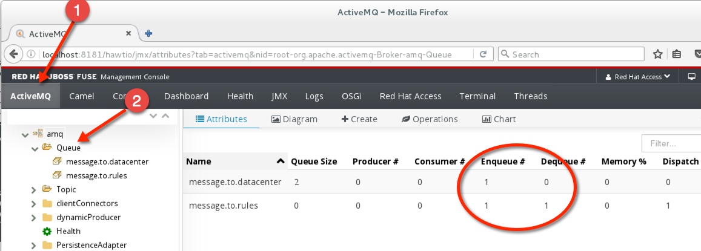

= IoT Summit Lab 2016 - Business Rules Service

:Author:    Patrick Steiner
:Email:     psteiner@redhat.com
:Date:      23.01.2016

:toc: macro

toc::[]

== Content

This repository contains the material needed to build and run the Business Rules Service
for the 2016 Red Hat Summit IoT Lab

== What does this Module do?
This Module validates data against predefined business rules and marks them according to
the result of the rules validation

=== How data is validated
The way this Service works, can be described with the following steps

1. data from one sensor reading is read from a defined Messagequeue
2. the sensor reading is handed over to the rules execution engine which alters the data according to the result. In our case there is a field 'result' which will be changed to '0' if no rule applied or '1' if a rule applied.
3. the altered data is placed into another defined Messagequeue
4. repeats at step 1.

== Configuration
The Rules Service can be configured via the following environment variables

[width="80%",frame="topbot",options="header"]
|==================================
| Variable |  Description | Default Value
| SOURCE_AMQ_BROKER | URL of the Message Broker who provides the Messagequeue to read Sensordata from | tcp://localhost:61616
| SOURCE_QUEUE| Name of the Messagequeue to read sensordata from | message.to.rules
| SOURCE_BROKER_ADMIN_UID | The username to connect to the source Messagebroker | admin
| SOURCE_BROKER_ADMIN_PASSWD | The password to connect to the source Messagebroker | change12_me
| TARGET_AMQ_BROKER | URL of the Message Broker who provides the Messagequeue to place Sensordata to | tcp://localhost:61616
| TARGET_QUEUE| Name of the Messagequeue to write sensordata to | message.to.datacenter
| TARGET_BROKER_ADMIN_UID | The username to connect to the target Messagebroker | admin
| TARGET_BROKER_ADMIN_PASSWD | The password to connect to the target Messagebroker | change12_me
|==================================

== Business Rules
The rules to validate if the received sensordata need some kind of alerting, are defined via
a 'Decision table'.

Decision tables are a precise yet compact way to model complex rule sets
 and their corresponding actions.
Decision tables, like flowcharts and if-then-else and switch-case
statements, associate conditions with actions to perform, but in many
cases do so in a more elegant way. ( from https://en.wikipedia.org/wiki/Decision_table[wikipedia] )

In our case, we will implement the Decision table as MS Excel Charts.

The following image shows a possible implementation of such a table,
with every row of the table representing one rule. The blue columns are 'conditions' and the yellow one defines an 'action'.

image::images/DecisionTable.png[]

The columns in this table represent the following

 * **Alerting Rule** is a name for a rule. It is not required to give every rule a name, but during debugging this might become handy!
 * **Device Type** the 'DeviceType' this rule will need to match with. This should be simular to the 'deviceType' you have used in the 'Software Sensor' configuration.
 * **Payload** the number-range this rule will need to match with. The first number represents the lower range while the second represents the higher range.
 * **Result** this column represents the action that a rule needs to perform. In our case the 'result' part of our message will be changed to '1' or '0', according to which rule applied.

== Changing Business Rules

=== Opening the Rules-File
Our business rules are written in an Spreadsheet, which you can open with any
MS Excel compliant spreadsheet programm. For this lab environment we provide you
with Apache OpenOffice.

To open the rules spreadsheet, open JBDS as explained earlier and double-click
the file 'DecisionTable.xls'

image::images/editRules.png[]

after a short time, you will be presented with the actual version of the rules
spreadsheet



=== Rules Syntax
Rules are always represented in a simple

```
when
   some condition
then
   some action

```

syntax. Luckily our rules system is capable of reading MS Excel files and compile
the rules from the spreadsheet into rules in the above syntax.

In the screenshot are four columns, which you will need to fill with content, so
that every row representing one rule.

 * *Alerting Rule* is a name for the rule in this row
 * *Device Type* is the 'deviceType' reported by the sensor
 * *Payload* is the data we want the rule to look for
 * *Result* is the value we want the rule to write into the field 'result'
 of the sensordata

The following screenshow represents two rules, which you should add to your
decision table as well.

 1. Rule: 'if we get a sensorreading from a *temperature* with the reported temperature between *0* and *60*, change the *result*
 field to *0*'
 2. Rule: 'if we get a sensorreading from a *temperature* with the reported temperature between *61* and *100*, change the *result*
 field to *1*'



[IMPORTANT]
When saving your changed spreadsheet, please make sure to save it in MS Excel format and not
odp ( Open Office ), as JBoss BRMS does only understand MS Excel.

== Building and Running the *Business Rules Service*
Now that we have added a few rules to our decision table, we only need to build
a new version of the service and start it.

As of now, you should have a terminal open, in which you started Red Hat JBoss Fuse
and another terminal in which you did build and deployed the Routing Service.

You can use the same terminal again, to build and start the *Business Rules Service*

To do so, enter the following commands in your terminal session

 [demo-user@localhost IoT_Summit_Lab]$ cd
 [demo-user@localhost ~]$ cd IoT_Summit_Lab/
 [demo-user@localhost IoT_Summit_Lab]$ ./runRulesService.sh
 < removed a output >
 AMQ-Broker tcp://localhost:61616 ready to work!

It should also print

 Device-Type = temperature
 Device-ID   = 4711
 Payload     = 70
 Result      = 1
 ----------------------
 Sending <?xml version="1.0" encoding="UTF-8" standalone="yes"?><dataSet><timestamp>18.05.2016 10:46:22 766</timestamp><deviceType>temperature</deviceType><deviceID>4711</deviceID><payload>70</payload><required>0</required><average>0.0</average><errorCode>1</errorCode></dataSet>

as this is the message, which we did send to our environment, when we tested
the *Routing Service*.

== Sending a test messages
As during the previous lab, we will try this service by sending a test message
via the *Software Sensor* to our setup. The following should happen.

 1. *Software Sensor* sends a message with a high value via MQTT
 2. *Routing Service* will pick it up, transform the message and send it
 to an AMQP message queue.
 3. *Business Rules Service* will take the transformed message from the queue
 and will put it in another AMQP message queue, but only if a business rule
 told him to.

To perform this test, perform the following steps

 * Open a new terminal windows



 * Start the provided script *runHighSensor.sh*, which will send one message

 [demo-user@localhost Desktop]$ cd
 [demo-user@localhost ~]$ cd IoT_Summit_Lab/
 [demo-user@localhost IoT_Summit_Lab]$ ./runHighSensor.sh
 Starting the producer to send messages
 Sending '70,0'

 * The terminal window in which you started the *Business Rules Service*, should
 now show the debug-output with the received data and the XML string, which
 is forwarded to another AMQP message queue for further processing.

 AMQ-Broker tcp://localhost:61616 ready to work!
 Device-Type = temperature
 Device-ID   = 4711
 Payload     = 70
 Result      = 1
 ----------------------
 Sending <?xml version="1.0" encoding="UTF-8" standalone="yes"?><dataSet><timestamp>17.05.2016 15:08:59 265</timestamp><deviceType>temperature</deviceType><deviceID>4711</deviceID><payload>70</payload><required>0</required><average>0.0</average><errorCode>1</errorCode></dataSet>
 ----------------------

 * Another way to verify that the message was properly processed is to take a
 look at Red Hat JBoss Fuse console via 'http://localhost:8181', as in the previous
 lab. The count of messages enqueued and dequeued shoud now show that one message
 has been taken from 'message.to.rules' and placed into 'message.to.datacenter'.


