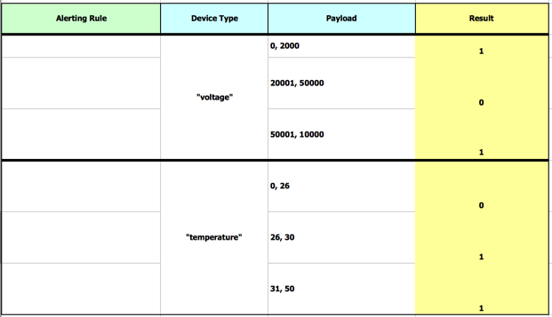
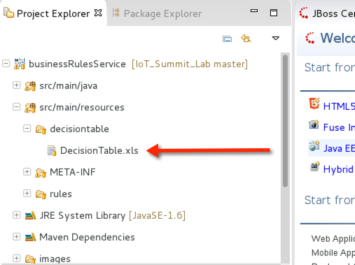
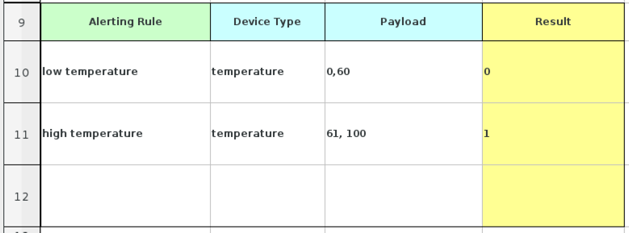
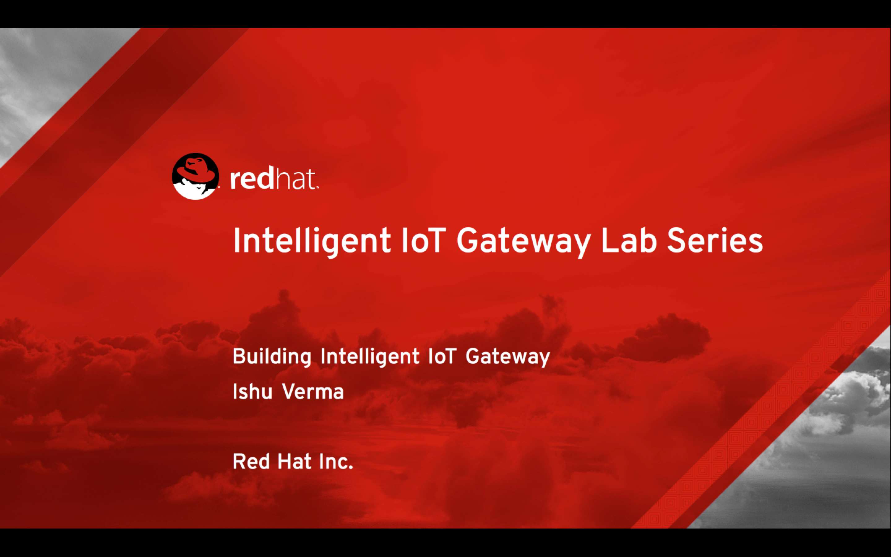

= Build Intelligent IoT Gateway for Arm 64 based Platforms

:Author:    Patrick Steiner, Ishu Verma
:Email:     psteiner@redhat.com, iverma@redhat.com
:Date:      01/05/2017

:toc: macro

toc::[]

== Overview
Intelligent IoT Gateway is a key component of enterprise Internet of Things (IoT) as it enables real time  decision-making at the edge, secures downstream devices and optimizes network utilization. In this lab, you'll learn how to build the Intelligent IoT Gateway with an Arm 64 platform - for this lab we used APM's Mustang platform but any other Arm 64 platform with RHEL should work as well. KEy components of the Gateway are:

* *Red Hat Enterprise Linux Developer Preview for Arm* to provide Enterprise class foundation
* *JBOSS Fuse* to transform sensor data and route it to end points
* *JBOSS BRMS* to enable real-time decision making at the edge
* *JBOSS A-MQ* to arbitrate sensor data

The first part of this lab is to install required software (Maven, JDK). Once the Gateway is provisioned, we'll put it into action by starting JBOSS Fuse, building & deploying the pre-built routing and business rules services. We'll then start sensor app that sends temperature data using MQTT to the JBOSS A-MQ broker. These messages will be forwarded to the services that we started earlier. Finally, we'll be creating the business rules to trigger desired action when the sensor value reaches a threshold. 

=== Requirements
- Install Red Hat Enterprise Linux 7.3 Developer Preview for Arm
- Download JBOSS Fuse 6.2.1 from the https://access.redhat.com/jbossnetwork/restricted/listSoftware.html?product=jboss.fuse&downloadType=distributions[Red Hat Customer Portal] and save it in the Downloads folder

=== Step 1 - Prepare the system

Enable the required repos and install maven:

 * Open a terminal and enter the following commands:
 [demo-user@localhost ~]$ subscription-manager repos --enable=rhel-7-for-arm-optional-rpms
 [demo-user@localhost ~]$ sudo yum install maven
 
=== Step 2 - Start JBoss Fuse Server

 * Open a new shell and enter the following commands:

  [demo-user@localhost ~]$ cd
  [demo-user@localhost ~]$ cd IoT_Summit_Lab
  [demo-user@iotlab IoT_Summit_Lab]$ ./runJBossFuse.sh

* Wait for the Red Hat JBoss Fuse to complete the start procedure

image:images/fuse_started.png[]

Red Hat JBoss Fuse needs to install the 'camel-mqtt' OSGi features to process MQTT messages. 

* Enter the following simple command on the 'JBossFuse' command prompt

 JBossFuse:karaf@root> features:install camel-mqtt

=== Step 3 - Build and Deploy Camel Route
The sensor data will be transformed and routed by a camel route provided in this project. Now we need to build the Red Hat JBoss Fuse project and deploy it to our running JBoss Fuse server. We’ll use the provided script to build and deploy the project.

 * In a new terminal, perform the following commands

 [demo-user@iotlab Software_Sensor]$ cd
 [demo-user@iotlab ~]$ cd IoT_Summit_Lab/
 [demo-user@iotlab IoT_Summit_Lab]$ ./runRoutingService.sh

**We can verify that the Camel route has been deployed by logging into JBOSS Fuse admin cosole https://github.com/ishuverma/Virtual-IoT_Summit_Lab/tree/Virtual-Lab-1/RoutingService#verify-that-the-camel-route-has-been-deployed[see details]**

=== Step 5 - Create Business Rules
One of the important functions of Intelligent IoT Gateway is trigger action if the sensor data meets certain condition defined by business rules. In this section we’ll learn how to create business rules service.  This service will work the following way:

1. Sensor data is read from a Message queue
2. Sensor data is handed over to the rules execution engine that triggers action per defined rules 
3. Altered data is placed into another defined Message queue

We'll use MS Excel based decision table to define the business rules. The following image shows an example of a Decision Table where each row represents a rule. The blue columns are 'conditions' and the yellow column define an 'action'.

Rules syntax is pretty simple: 
If
   some condition
then
   some action
   
The rules system is capable of reading the rules from a spreadsheet  and compile them into rules in the above syntax.  For this lab, sample business rule spreadsheet is provided that can be used to create new rules. 

The columns in this table represent the following:

_Alerting Rule: Name of the rule. It is optional field but very useful for debugging_

_Device Type: Type of device reported by the sensor_

_Payload: Number-range this rule will need to match with_

_Result: Action triggered by the rule i.e. changing value to 0 or 1_
 
 * Open the sample rules spreadsheet: 'DecisionTable.xls'

 * Create two rules by filling in the following information 

- Rule 1: If we get a temperature reading between 0 and 60, change the result field to 0
- Rule 2: If we get a temperature reading between 61 and 100, change the result field to 1

_Note: In the 2nd rule Payload, add a space between “61,” and “100”_

_Note: Save the spreadsheet in MS Excel format_

*The details on the Business Rules Service are https://github.com/ishuverma/Virtual_IoT_Gateway/tree/Virtual-Lab-1/BusinessRulesService[here]*

=== Step 6: Build and Run the *Business Rules Service*
Now that we have added a few rules to our decision table, we need to build
a new version of the service and start it.

 * Enter the following commands in a terminal

 [demo-user@localhost IoT_Summit_Lab]$ cd
 [demo-user@localhost ~]$ cd IoT_Summit_Lab/
 [demo-user@localhost IoT_Summit_Lab]$ ./runRulesService.sh
 
It should display following output
 < output truncated >
 AMQ-Broker tcp://localhost:61616 ready to work!

 Device-Type = temperature
 Device-ID   = 4711
 Payload     = 70
 Result      = 1
 ----------------------
 Sending <?xml version="1.0" encoding="UTF-8" standalone="yes"?><dataSet><timestamp>18.05.2016 10:46:22 766</timestamp><deviceType>temperature</deviceType><deviceID>4711</deviceID><payload>70</payload><required>0</required><average>0.0</average><errorCode>1</errorCode></dataSet>

=== Step 7: Test Rule Service
We will try this service by sending a test message via the *Software Sensor* to our setup. The following should happen:

*Software Sensor* sends a message with a high value via MQTT

*Routing Service* will pick it up, transform the message and send it to an AMQP message queue

*Business Rules Service* will take the transformed message from the queue and will put it in another AMQP message queue, but only if it meets the business rule condition
 
 
 * Enter the following commands in a new terminal

 [demo-user@localhost Desktop]$ cd
 [demo-user@localhost ~]$ cd IoT_Summit_Lab/
 [demo-user@localhost IoT_Summit_Lab]$ ./runHighSensor.sh

It should display following output
 
 Starting the producer to send messages
 Sending '70,0'

 AMQ-Broker tcp://localhost:61616 ready to work!
 Device-Type = temperature
 Device-ID   = 4711
 Payload     = 70
 Result      = 1
 ----------------------
 Sending <?xml version="1.0" encoding="UTF-8" standalone="yes"?><dataSet><timestamp>17.05.2016 15:08:59 265</timestamp><deviceType>temperature</deviceType><deviceID>4711</deviceID><payload>70</payload><required>0</required><average>0.0</average><errorCode>1</errorCode></dataSet>
 ----------------------

Another way to verify that the message was properly processed is to take a
 look at Red Hat JBoss Fuse console via 'http://localhost:8181', The count of messages enqueued and dequeued shoud now show that one message has been taken from 'message.to.rules' and placed into 'message.to.datacenter'.
 
_Note: Fuse console login/password is admin/change12_me_

image:images/testResult.png[]

*--------------------- End of Lab ---------------------*

