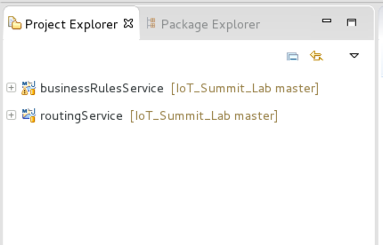

= IoT Summit Lab 2016

:Author:    Patrick Steiner
:Email:     psteiner@redhat.com
:Date:      23.01.2016

:toc: macro

toc::[]

== Content
This repository contains the material build for the 2016 Red Hat Summit.

The following sub-projects have been created

* https://github.com/PatrickSteiner/IoT_Summit_Lab/tree/master/Software_Sensor[Software Sensors]: a software sensor who could can be used to simulate sensor data creation.
* https://github.com/PatrickSteiner/IoT_Summit_Lab/tree/master/BusinessRulesService[Rules Service]: a service which receives data from a defined AMQ-Queue, validates those against Business Rules and drops the results in another defined AMQ-Queue
* https://github.com/PatrickSteiner/IoT_Summit_Lab/tree/master/RoutingService[Routing Service]: the service who receives, transforms and routes messages from one destination to the next.

== Installing Red Hat JBoss Fuse
In our lab environment, we do need to have a running instance of
Red Hat JBoss Fuse. To install this, please perform the following steps

1. Login to you lab-environment with

 username = 'demo-user'
 password = 'change12_me'

2. Open a terminal

image::images/image1.png[]

3. In the shell perform the following steps

 [demo-user@localhost ~]$ cd
 [demo-user@localhost ~]$ unzip jboss-fuse-full-6.2.1.redhat-084.zip
 [demo-user@localhost ~]$ ln -s jboss-fuse-6.2.1.redhat-084 fuse

These simple steps complete the installation of Red Hat JBoss Fuse.

== Starting the development tooling
For our development activities, we will be using JBoss Developer Studio V8.1 (JBDS), an
Eclipse based tooling.

To start JBDS, double-click the provided icon on the dashboard.

image::images/image2.png[]

In the 'Project Explorer' Eclipse view, you will see our two project which we
will be using in later stages of our lab.

 * 'businessRulesService' for our Rules Service
 * 'routingService' for our Routing Service

