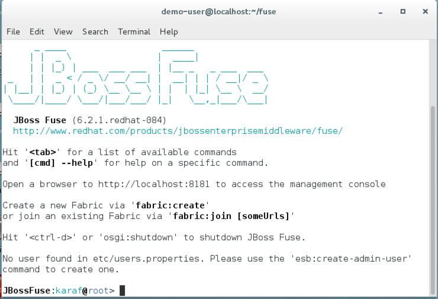
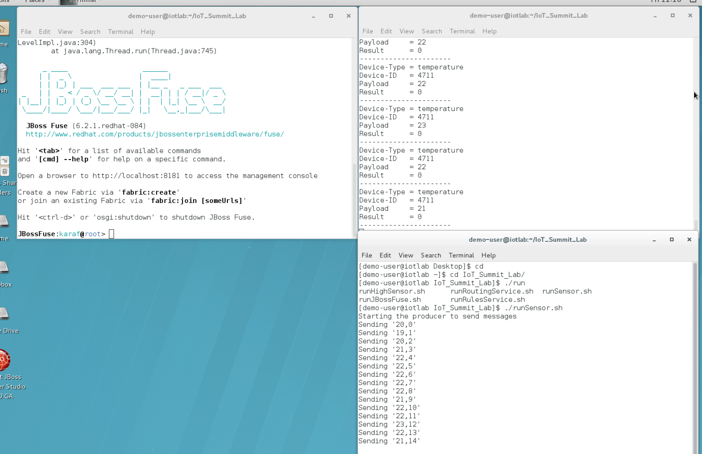
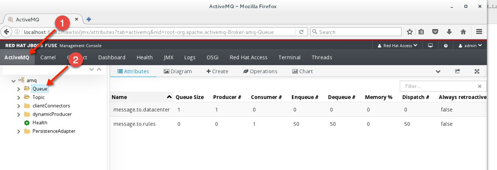
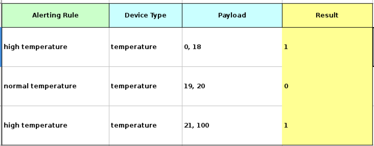

= Build Intelligent IoT Gateway in a Few Easy Steps

:Author:    Patrick Steiner, Ishu Verma
:Email:     psteiner@redhat.com, iverma@redhat.com
:Date:      09/14/2016

:toc: macro

toc::[]

== Overview
Intelligent IoT Gateway is the core pillar of enterprise Internet of Things (IoT) architecture because it enables real time  decision-making at the edge, secures downstream devices and optimizes network utilization. In this lab, you'll learn how to build the Intelligent IoT Gateway with open source software in a few simple steps. 

This Gateway can be implemented on a physical hardware (x84 64 bit) or a virtual machine running RHEL 7.2. The JBOSS Fuse uses camel to  transform and route the sensor data. While JBOSS BRMS allows real-time decision making at the edge per defined business rules. The task of configuring the system including installing required software is automated through Ansible.

=== Step 2 - Start JBoss Fuse Server

 * Open a new shell and enter the following commands:

  [demo-user@localhost ~]$ cd
  [demo-user@localhost ~]$ cd IoT_Summit_Lab
  [demo-user@iotlab IoT_Summit_Lab]$ ./runJBossFuse.sh

* Wait for the Red Hat JBoss Fuse to complete the start procedure

* To be able to process MQTT messages, Red Hat JBoss Fuse needs to install the
'camel-mqtt' OSGi features. To to this, enter the following simple command on the
'JBossFuse' command prompt

 JBossFuse:karaf@root> features:install camel-mqtt

* Minimize this shell to keep JBOSS Fuse server running in the background

image:images/minimize_fuse.png[]

=== Step 3 - Build and Deploy Camel Route
The sensor data will be transformed and routed by a camel route provided in this project. Now we need to build the Red Hat JBoss Fuse project and deploy it to our running JBoss Fuse server. We’ll use the provided script to build and deploy the project.

 * In a terminal, perform the following commands

 [demo-user@iotlab Software_Sensor]$ cd
 [demo-user@iotlab ~]$ cd IoT_Summit_Lab/
 [demo-user@iotlab IoT_Summit_Lab]$ ./runRoutingService.sh

**We can verify that the Camel route has been deployed by logging into JBOSS Fuse admin cosole https://github.com/ishuverma/Virtual-IoT_Summit_Lab/tree/Virtual-Lab-1/RoutingService#verify-that-the-camel-route-has-been-deployed[see details]**

=== Step 4 - Create Business Rules
One of the important functions of Intelligent IoT Gateway is trigger action if the sensor data meets certain condition defined by business rules. In this section we’ll learn how to create business rules service.  This service will work the following way:

- Sensor data is read from a Message queue
- Sensor data is handed over to the rules execution engine that triggers action per defined rules 
- Altered data is placed into another defined Message queue

We'll use MS Excel based decision table to define the business rules. The following image shows an example of a Decision Table where each row represents a rule. The blue columns are 'conditions' and the yellow column define an 'action'.

image:BusinessRulesService/images/DecisionTable.png[]

Rules syntax is pretty simple: 
If
   some condition
then
   some action
The rules system is capable of reading the rules from a spreadsheet  and compile them into rules in the above syntax.  For this lab, sample business rule spreadsheet is provided that can be used to create new rules. 

image:BusinessRulesService/images/DecisionTablexls.png[]

The columns in this table represent the following

 * **Alerting Rule** Name of the rule. It is optional field but very useful for debugging
 * **Device Type** Type of device reported by the sensor
 * **Payload** Number-range this rule will need to match with
 * **Result** Action triggered by the rule i.e. changing value to 0 or 1
 
**Create two rules by filling in the following information** 

Rule 1: If we get a temperature reading between 0 and 60, change the result field to 0
Rule 2: If we get a temperature reading between 61 and 100, change the result field to 1

_Note: In the 2nd rule Payload, add a space between “61,” and “100”_

image:BusinessRulesService/images/sampleRule.png[]

_Note: Save the spreadsheet in MS Excel format_

=== Step 5: Build and Run the *Business Rules Service*
Now that we have added a few rules to our decision table, we need to build
a new version of the service and start it.

Enter the following commands in a terminal

 [demo-user@localhost IoT_Summit_Lab]$ cd
 [demo-user@localhost ~]$ cd IoT_Summit_Lab/
 [demo-user@localhost IoT_Summit_Lab]$ ./runRulesService.sh
 
It should display following output
 < output truncated >
 AMQ-Broker tcp://localhost:61616 ready to work!

 Device-Type = temperature
 Device-ID   = 4711
 Payload     = 70
 Result      = 1
 ----------------------
 Sending <?xml version="1.0" encoding="UTF-8" standalone="yes"?><dataSet><timestamp>18.05.2016 10:46:22 766</timestamp><deviceType>temperature</deviceType><deviceID>4711</deviceID><payload>70</payload><required>0</required><average>0.0</average><errorCode>1</errorCode></dataSet>

=== Step 6: Test Rule Service
We will try this service by sending a test message via the *Software Sensor* to our setup. The following should happen.

 1. *Software Sensor* sends a message with a high value via MQTT
 2. *Routing Service* will pick it up, transform the message and send it to an AMQP message queue.
 3. *Business Rules Service* will take the transformed message from the queue and will put it in another AMQP message queue, but only if it meets the business rule condition

* Enter the following commands in a new terminal

 [demo-user@localhost Desktop]$ cd
 [demo-user@localhost ~]$ cd IoT_Summit_Lab/
 [demo-user@localhost IoT_Summit_Lab]$ ./runHighSensor.sh

* It should display following output
 Starting the producer to send messages
 Sending '70,0'

 AMQ-Broker tcp://localhost:61616 ready to work!
 Device-Type = temperature
 Device-ID   = 4711
 Payload     = 70
 Result      = 1
 ----------------------
 Sending <?xml version="1.0" encoding="UTF-8" standalone="yes"?><dataSet><timestamp>17.05.2016 15:08:59 265</timestamp><deviceType>temperature</deviceType><deviceID>4711</deviceID><payload>70</payload><required>0</required><average>0.0</average><errorCode>1</errorCode></dataSet>
 ----------------------

 * Another way to verify that the message was properly processed is to take a
 look at Red Hat JBoss Fuse console via 'http://localhost:8181', The count of messages enqueued and dequeued shoud now show that one message has been taken from 'message.to.rules' and placed into 'message.to.datacenter'.

image:BusinessRulesService/images/testResult.png[]

== Content
This project uses the following subprojects:
* https://github.com/PatrickSteiner/IoT_Summit_Lab/tree/master/Software_Sensor[Software Sensors]: a software sensor who could can be used to simulate sensor data creation.
* https://github.com/PatrickSteiner/IoT_Summit_Lab/tree/master/BusinessRulesService[Rules Service]: a service which receives data from a defined AMQ-Queue, validates those against Business Rules and drops the results in another defined AMQ-Queue
* https://github.com/PatrickSteiner/IoT_Summit_Lab/tree/master/RoutingService[Routing Service]: the service who receives, transforms and routes messages from one destination to the next.

This project leverages the camel routes to transform sensor data and places them in appropriate queues. In this lab weWe’ll also set up business rules to enable real-time decision making at the edge and filter data to the datacenter.
This repository contains the material needed to replicate the IoT Gateway lab from the 2016 Red Hat Summit.

The following sub-projects have been created

== Lab 0 - Preparing the Lab Environment
If you should do these labs on an environment, which was not prepared for it,
please follow the https://github.com/PatrickSteiner/IoT_Summit_Lab/blob/master/BuildVM.adoc[instructions] on how to setup a lab environment.

== Lab 1 - Installing Red Hat JBoss Fuse
In our lab environment, we do need to have a running instance of
Red Hat JBoss Fuse. To install this, please perform the following steps

* Login to you lab-environment with

 username = 'demo-user'
 password = 'change12_me'

* Open a terminal

image::images/image1.png[]

* In the shell perform the following steps

 [demo-user@localhost ~]$ cd
 [demo-user@localhost ~]$ unzip jboss-fuse-full-6.2.1.redhat-084.zip
 [demo-user@localhost ~]$ ln -s jboss-fuse-6.2.1.redhat-084 fuse

* Close the shell

 [demo-user@localhost ~]$ exit

These simple steps complete the installation of Red Hat JBoss Fuse.

== Lab 2 - Starting JBoss Fuse
We will start the JBoss Fuse server and will leave it running in the background. Deployment
to the server will be done "hot", which is definately not a best-practice, but
for the sake of this lab, it's absolutely sufficient.

To start JBoss Fuse, please follow these simple steps

 * Open a new shell, as described in the previous section
 * Enter the following commands

  [demo-user@localhost ~]$ cd
  [demo-user@localhost ~]$ cd IoT_Summit_Lab
  [demo-user@iotlab IoT_Summit_Lab]$ ./runJBossFuse.sh

* Wait for the Red Hat JBoss Fuse to complete the start procedure

* To be able to process MQTT messages, Red Hat JBoss Fuse needs to install the
'camel-mqtt' OSGi features. To to this, enter the following simple command on the
'JBossFuse' command prompt

 JBossFuse:karaf@root> features:install camel-mqtt

* Minimize this shell, as we don't need it at the moment

image::images/minimize_fuse.png[]

== Lab 3 - Building and Running the Software Sensor
The instructions on building and running the *Software Sensor* are located https://github.com/PatrickSteiner/IoT_Summit_Lab/tree/master/Software_Sensor[here].

== Lab 4 - Building and Running the first Messageflow
The instructions on building and running the first Flow are located https://github.com/PatrickSteiner/IoT_Summit_Lab/tree/master/RoutingService[here].

== Lab 5 - Building and Running the Business Rules Service
The instructions on building and running the Business Rules Service are located https://github.com/PatrickSteiner/IoT_Summit_Lab/tree/master/BusinessRulesService[here].

== Lab 6 - Running the Software Sensor to create multiple sensor readings
In this lab we will use the `Software Sensor` from *Lab 3* to create a stream
of sensordata and will observe the effect our Business Rules from *Lab 7* has
on the data.

Please follow the following steps

 * Open a Terminal session or click on an open one

 * In the Terminal session, run the following commands

 [demo-user@iotlab Desktop]$ cd
 [demo-user@iotlab ~]$ cd IoT_Summit_Lab/
 [demo-user@iotlab IoT_Summit_Lab]$ ./runSensor.sh

You will see the sensordata being produced and received by the `Business Rules Service`, as
documented in the following image.

 * You can use the number of messages in the various Queues to verify that the
 `Business Rules Service` did filter the messages as expected. To do so,
 go back to your browser windows and navigate to the page showing the Queues
 and their content.

In this case, you can see that all produced 50 messages were place into and
consumed from the queue `message.to.rules` but not a single one was placed
into the queue `message.to.datacenter` by the `Business Rules Service`.

The reason for this are our implemented rules, which considered these values
to be in range and therefor not required for further processing.

 * To get a different result you could up 

 * Now you just need to

 ** stop the running `Business Rules Service` task by hitting
`CTRL-C` in the right terminal session

 ** re-build and start the updated `Business Rules Service`
as described and done in *Lab 5*

 ** re-run the sensor

 ** validate the number of messages per Queue in the JBoss Fuse Browser
