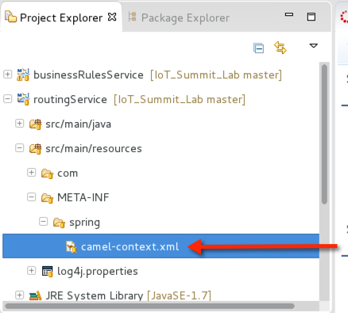
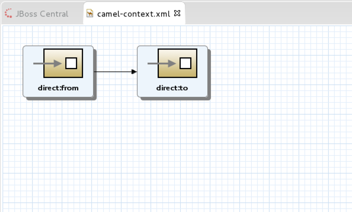
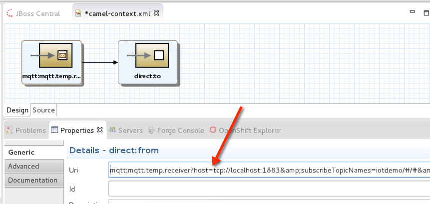
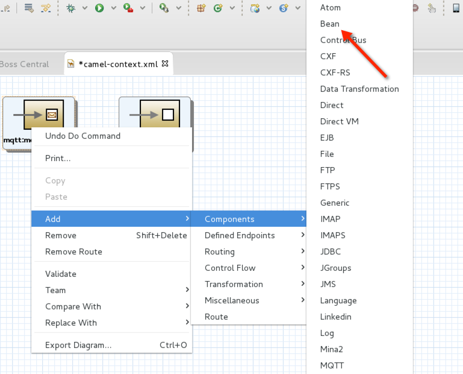
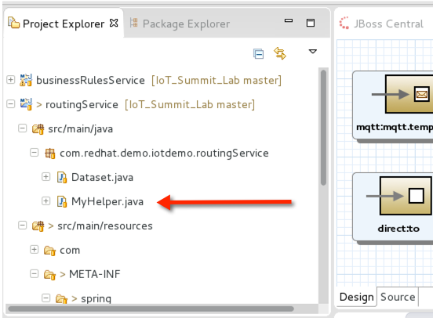
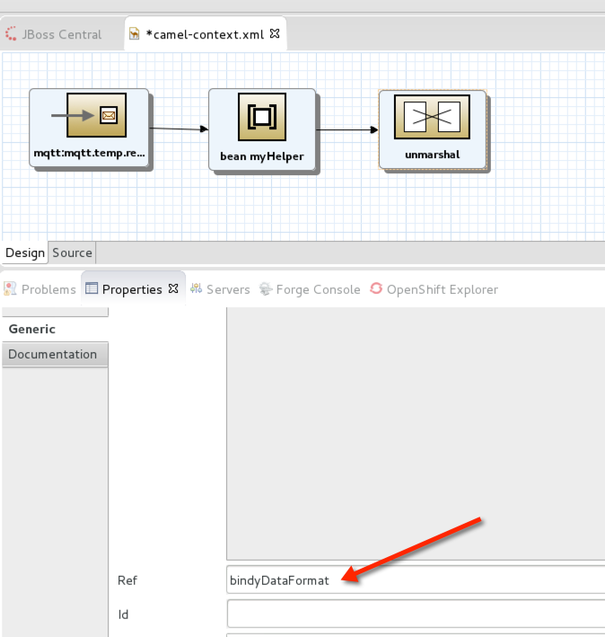
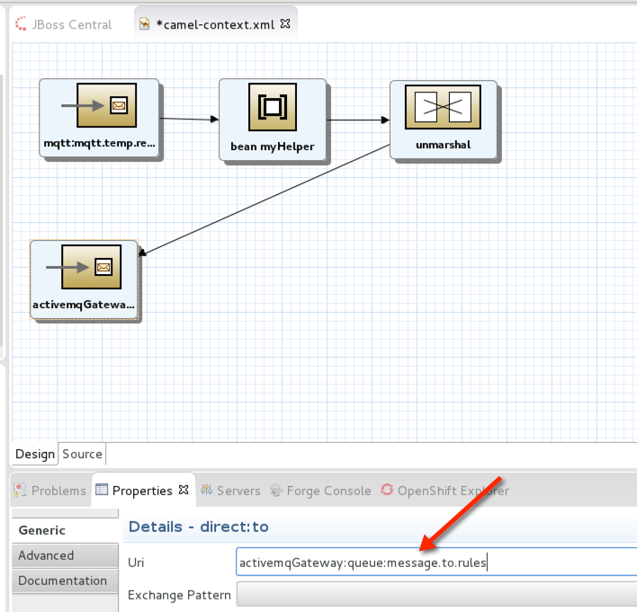
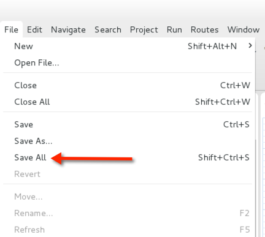

= IoT Summit Lab 2016 - Routing Service

:Author:    Patrick Steiner
:Email:     psteiner@redhat.com
:Date:      23.01.2016

:toc: macro

toc::[]

== Content

This repository contains the material needed to build and run the Business Rules Service
for the 2016 Red Hat Summit IoT Lab

== What does this Module do?
This module is responsible for providing the logic to handle messages. Core
tasks are

  * reading messages from Messagequeues
  * transforming messages from one dataformat ( CVS ) to another ( XML )
  * routing messages to their next destination, based on a predefined logic
  * routing messages to their next destination, based on the content of a message

== Configuration
The Rules Service can be configured via the following environment variables, which are similar
to the ones defined for the https://github.com/PatrickSteiner/IoT_Summit_Lab/tree/master/BusinessRulesService[Business Service].

[width="80%",frame="topbot",options="header"]
|==================================
| Variable |  Description | Default Value
| SOURCE_AMQ_BROKER | URL of the Message Broker who provides the Messagequeue to read Sensordata from | tcp://receiver:61616
| SOURCE_BROKER_ADMIN_UID | The username to connect to the source Messagebroker | admin
| SOURCE_BROKER_ADMIN_PASSWD | The password to connect to the source Messagebroker | change12_me
|==================================

== How to deploy
For your convenience, we provided the script 'buildRouting.sh' which builds the
'Routing Service' and deploys it to a https://www.redhat.com/en/technologies/jboss-middleware/fuse[Red Hat JBoss Fuse] instance.

== Flow 1 - Receive, Transform and Forward

For your convenience we provided code-frames for you to be able to
develop the JBoss Fuse logic.

=== Opening the Flow Editor

To access these code-frames, double-click the provided 'camel-context.xml' file.



this will open the flow in it's visual editor.



=== Developing the flow
The flow we will be developing will perform the following steps

 1. receive a comma separated values ( CSV ) MQTT message from any MQTT-Topic with the name 'iotdemo/<something>/<something'
 2. transform the CSV message to XML
 3. send XML message to a AMQP Messagequeue

==== Adding the receiver to the flow
Open the property setting of the 'direct:from' icon, also known as node, by selecting the icon and
then selecting the 'Properties' pane in the Eclipse tooling.

image::images/openFromProperties.png[]

Change the 'Uri' of the node to

```
mqtt:mqtt.temp.receiver?host=tcp://localhost:1883&amp;subscribeTopicNames=iotdemo/#/#&amp;userName=admin&amp;password=change12_me
```



Let's analyze this long string:

 * *mqtt:* defines this node to be a MQTT connector
 * *mqtt.temp.receiver* defines a unique name with which this MQTT receiver identifies
 himself to a MQTT Broker
 * *host=tcp://localhost:1883* defines the URL of the MQTT Broker to which this receiver
 connects to
 * *subscribeTopicNames=iotdemo/\#/#* subscribes to any topic starting with `iotdemo`
 and has two more parts, which we subscribe to via wildcards
 * *userName=admin&amp;password=change12_me* defines the username and password which
 this receiver uses to authenticate to the MQTT Broker

==== Changing the CSV message to a Java Object
In this step we will introduce the capabilities needed to

 1. extract the data from the MQTT Topic and the payload
 2. build an XML structure based the data from the MQTT Topic and the payload

Start by selecting the connection between the MQTT and the second node and removing it.

image::images/deleteFromToConnection.png[]

Now you can add a 'Bean' to the MQTT Node by selecting it and adding the component 'Bean'.



In the properties of the newly created 'Bean', please define the following values:

 * *Bean Type* to `com.redhat.demo.routingService.MyHelper`
 * *Method* to `enhanceMessage`
 * *Bean Name* to `myHelper`

image:images/defineBean.png[]

What does this Node do? It will take the CSV message from the MQTT Topic and will
hand if to a method 'enhanceMessage' in the Java Class named 'com.redhat.demo.routingService.MyHelper', which
then creates an instance of Java Class 'Dataset', which represents all the data
we use and need.

If you want to see the Java code for 'Dataset', open the following file:

image:images/openDataset.png[]

'com.redhat.demo.routingService.MyHelper' is a Java Object, which we provided to
you to show how simple JBoss Fuse can be extended with custom functionality.

If you want to see the Java code for this object, open the following file:



==== Transforming the Java Object to XML
Now that we have all our relevant data transformed into a Java object, we can
use JBoss Fuse to transform it.

To do so, select the 'bean myHelper' and add the 'Unmarshal' functionality.

image:images/addMarshall.png[]

In the properties pane of the newly created Node, please add the *ref* the 'bindyDataFormat'.



This tells JBoss Fuse which functionality to use to transform the Java Object to XML.

==== Adding the final send to the flow
All that is left to do is to change our logic to send the created XML to our AMQP
Messagequeue. To do this, select the 'unmarshal' Node and drag the small black arrow to
the 'direct:to' node.

image:images/connectMarshallToEnd.png[]

This will take care that the XML message will be transported from the 'unmarshall' step
to the 'direct:to' node, so you will not have to worry about the flow of the message itself.

Last thing to do is to configure the sending node, to do this please select
the 'direct:to' node and change the properties as shown in the image below.



Please do not forget to save your changes, as this will complete this exercise.




== Flow 2 - Filter and Forward to Backend
